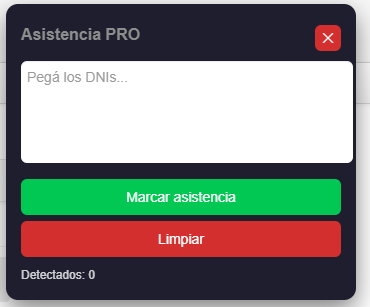

# 🧩 Asistencia SIU Guaraní PRO


Extensión de Chrome para marcar asistencia automáticamente en SIU Guaraní a partir de una lista de DNIs.

Pensada para agilizar el trabajo docente y administrativo, eliminando tareas manuales repetitivas.

---

## ✨ Funcionalidades

- ✅ Panel flotante integrado en la página (no popup)
- ✅ Activación desde el ícono de la extensión
- ✅ Pegado directo desde Excel o texto plano
- ✅ Limpieza automática de formato (espacios, puntos, etc.)
- ✅ Detección y conteo de DNIs en tiempo real
- ✅ Marcado automático de asistencia
- ✅ Scroll automático (recorre toda la lista)
- ✅ Resaltado visual de alumnos marcados
- ✅ Persistencia de datos (recuerda la última lista)
- ✅ Botón de limpiar lista
- ✅ Manejo de errores y logs en consola

---

## 🖼️ Vista previa



> El panel aparece flotante en la esquina superior derecha y permite gestionar la asistencia de forma rápida.

---

## 📁 Estructura del proyecto

```

asistencia-guarani-pro/
│
├── manifest.json
├── background.js
├── content.js
├── styles.css
└── icons/

```

---

## 🚀 Instalación

1. Descargar o clonar este repositorio
2. Abrir Chrome y navegar a: `chrome://extensions/`
3. Activar **Modo desarrollador**
4. Hacer clic en **"Cargar descomprimida"**
5. Seleccionar la carpeta del proyecto

---

## 🎯 Uso

1. Abrir SIU Guaraní en la pantalla de asistencia
2. Hacer clic en el ícono de la extensión
3. Se abrirá el panel flotante
4. Pegar la lista de DNIs
5. Presionar **"Marcar asistencia"**

---

## 📌 Formato de entrada

Se acepta solo formatos número sin puntos ni comas.
**Ejemplos válidos:**

```

12345678, 98765432, 23456789

```

**Ejemplos no válidos:**

```

12.345.678
98 765 432

```

---

## ⚠️ Consideraciones

- La extensión depende de la estructura HTML de SIU Guaraní (puede romperse ante cambios del sistema)
- Solo interactúa con los alumnos presentes en la vista actual (incluye scroll automático)
- El rendimiento puede variar según la cantidad de alumnos cargados
- Se recomienda validar los resultados antes de confirmar la operación

---

## 🤝 Créditos y agradecimientos

Este proyecto se basa en una idea original surgida en el ámbito de la **Universidad Nacional de Hurlingham (UNaHur)**, a partir del trabajo y la experiencia de docentes y alumnos.

Aportes clave:

- 💡 La idea inicial de automatizar el marcado de asistencia surge del trabajo de **Matías Müller**
- 🚀 La iniciativa de llevar esta solución a una extensión de Chrome fue impulsada por **Hernán Coniglio**

Sobre esa base, se desarrolló esta versión, con foco en usabilidad, mantenimiento y extensibilidad, orientada a su aplicación en contextos reales.

---

## 👨‍💻 Contribuciones

El proyecto está abierto a mejoras.

Se valoran especialmente aportes en:

- UI/UX (experiencia de uso)
- Robustez ante cambios de SIU
- Performance en listas grandes
- Nuevas funcionalidades

Para contribuir:

1. Fork del repositorio
2. Crear una rama (`feature/nombre-descriptivo`)
3. Commit de cambios claros
4. Enviar Pull Request

Toda mejora orientada a uso real es bienvenida.

---

## 🧠 Enfoque del proyecto

Esta herramienta está diseñada como:

- ✔ Solución práctica de automatización
- ✔ Código mantenible y extensible
- ✔ Uso real en entornos productivos

---

## 📄 Licencia

Uso interno / educativo. Adaptar según necesidad.

---

## 🙌 Autor

Desarrollado para optimizar el proceso de asistencia en SIU Guaraní.

---
